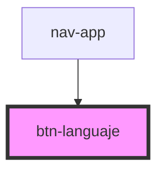

# btn-languaje

<!-- Auto Generated Below -->

## Properties

| Property | Attribute | Description | Type     | Default    |
| -------- | --------- | ----------- | -------- | ---------- |
| `lg`     | `lg`      |             | `string` | `'es'`     |
| `text`   | `text`    |             | `string` | `"Button"` |

## Dependencies

### Used by

 - [nav-app](../nav-app)

### Graph

----------------------------------------------

*Built with [StencilJS](https://stenciljs.com/)*
