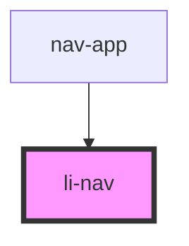

# li-nav

<!-- Auto Generated Below -->

## Properties

| Property | Attribute | Description | Type     | Default |
| -------- | --------- | ----------- | -------- | ------- |
| `icon`   | `icon`    |             | `string` | `''`    |
| `link`   | `link`    |             | `string` | `''`    |
| `text`   | `text`    |             | `string` | `''`    |

## Dependencies

### Used by

 - [nav-app](../nav-app)

### Graph

----------------------------------------------

*Built with [StencilJS](https://stenciljs.com/)*
