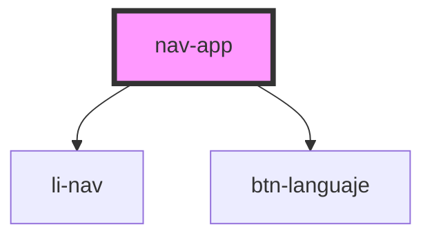

# nav-app

<!-- Auto Generated Below -->

## Properties

| Property   | Attribute | Description | Type        | Default                                                                                                                                                                                                           |
| ---------- | --------- | ----------- | ----------- | ----------------------------------------------------------------------------------------------------------------------------------------------------------------------------------------------------------------- |
| `itemList` | --        |             | `NavItem[]` | `[     { text: 'home', icon: 'fa-solid fa-house', link: '/' },     { text: 'about', icon: 'fa-solid fa-circle-info', link: '/about' },     { text: 'stencil', icon: 'fa-solid fa-house', link: '/stencil' },   ]` |
| `lg`       | `lg`      |             | `string`    | `'es'`                                                                                                                                                                                                            |
| `tittle`   | `tittle`  |             | `string`    | `''`                                                                                                                                                                                                              |

## Dependencies

### Depends on

- [li-nav](../li-nav)
- [btn-languaje](../btn-languaje)

### Graph

----------------------------------------------

*Built with [StencilJS](https://stenciljs.com/)*
